# 🏭 Laboratorio Modbus TCP - Sistema de Control Industrial

**Laboratorio completo de Modbus TCP** para aprendizaje de comunicaciones industriales, protocolos SCADA y sistemas de control.

## 🎯 ¿Qué incluye este laboratorio?

- ✅ **Servidor Modbus TCP**: Simula un PLC con sensores (temperatura, presión, nivel)
- ✅ **Cliente de Monitoreo**: Lee y muestra variables en tiempo real cada 10 segundos
- ✅ **Dashboard Node-RED**: Visualización web profesional con gráficos en tiempo real
- ⚠️ **FUXA SCADA**: HMI alternativo (disponible pero con limitaciones)

---

## 🚀 Inicio Rápido

### Requisitos Previos
- Docker >= 20.10
- Docker Compose >= 1.29
- Puertos disponibles: 1880, 1881, 5020

### Iniciar el Laboratorio Completo

```bash
# 1. Ir al directorio del proyecto
cd /mnt/HC_Volume_102919965/modbus_tcp_lab

# 2. Iniciar todos los servicios
./start.sh

# 3. Acceder al Dashboard
# Navegador: http://65.109.226.13:1880/ui
```

¡Listo! El sistema estará operativo en ~30 segundos.

### Detener el Laboratorio

```bash
./stop.sh
```

---

## 🏗️ Arquitectura del Sistema

```mermaid
graph TB
    subgraph "Red Docker: modbus_network (172.25.0.0/24)"
        subgraph "Servidor PLC"
            PLC[🏭 Modbus Server<br/>172.25.0.10:502<br/>Puerto Host: 5020]
        end
        
        subgraph "Interfaces de Visualización"
            NR[📊 Node-RED Dashboard<br/>172.25.0.21:1880<br/>Puerto Host: 1880]
            FUXA[🖥️ FUXA SCADA<br/>172.25.0.20:1881<br/>Puerto Host: 1881]
        end
        
        subgraph "Monitoreo"
            CLIENT[📡 Modbus Client<br/>172.25.0.11<br/>Lee cada 10s]
        end
        
        PLC -->|Modbus TCP<br/>FC3/FC4| NR
        PLC -->|Modbus TCP| FUXA
        PLC -->|Modbus TCP<br/>Polling| CLIENT
    end
    
    subgraph "Acceso Externo"
        USER[👨‍💻 Usuario<br/>65.109.226.13]
    end
    
    USER -->|HTTP :1880/ui| NR
    USER -->|HTTP :1881| FUXA
    USER -->|Modbus :5020| PLC
    
    style PLC fill:#ff9999,stroke:#ff0000,stroke-width:3px
    style NR fill:#99ff99,stroke:#00ff00,stroke-width:3px
    style FUXA fill:#ffff99,stroke:#ffaa00,stroke-width:2px
    style CLIENT fill:#99ccff,stroke:#0066cc,stroke-width:2px
    style USER fill:#cc99ff,stroke:#9900ff,stroke-width:2px
```



### Componentes del Sistema

| Componente | IP Interna | Puerto Host | Función |
|------------|------------|-------------|---------|
| **Modbus Server** | 172.25.0.10:502 | 5020 | Simula PLC industrial con 8 variables |
| **Node-RED** | 172.25.0.21:1880 | 1880 | Dashboard web con visualización en tiempo real |
| **FUXA SCADA** | 172.25.0.20:1881 | 1881 | HMI alternativo (experimental) |
| **Modbus Client** | 172.25.0.11 | - | Monitor que lee variables cada 10s |

---

## 📊 Acceso a las Interfaces

| Servicio | URL Externa | URL Local | Estado |
|----------|-------------|-----------|--------|
| **Node-RED Dashboard** | http://65.109.226.13:1880/ui | http://localhost:1880/ui | ✅ **Recomendado** |
| **Editor Node-RED** | http://65.109.226.13:1880 | http://localhost:1880 | ✅ Edición de flujos |
| **FUXA SCADA** | http://65.109.226.13:1881 | http://localhost:1881 | ⚠️ Experimental |
| **Servidor Modbus TCP** | 65.109.226.13:5020 | localhost:5020 | ✅ Puerto Modbus |

---

## 📁 Estructura del Proyecto

```
modbus_tcp_lab/
├── docker-compose.yml              # Orquestación de contenedores
├── start.sh                        # Script de inicio rápido
├── stop.sh                         # Script de detención
├── status.sh                       # Script de verificación
├── modbus-server/                  # Servidor Modbus TCP (PLC)
│   ├── modbus_server.py           # Código del servidor
│   ├── config.json                # Configuración de variables
│   ├── Dockerfile
│   └── requirements.txt
├── modbus-client/                  # Cliente de monitoreo
│   ├── modbus_client.py           # Cliente que lee cada 10s
│   ├── Dockerfile
│   └── requirements.txt
├── scada-hmi/                      # FUXA SCADA
│   └── data/                      # Datos persistentes
├── nodered/                        # Node-RED Dashboard
│   └── data/                      # Flujos y configuración
├── ACCESO_NODE_RED.md             # Documentación detallada del dashboard
└── QUICKSTART.md                  # Guía rápida para estudiantes
```

---

## 🔧 Variables Modbus Disponibles

### Input Registers (Sensores - Solo Lectura)

```mermaid
graph LR
    subgraph "Input Registers - FC4 (Read Input Registers)"
        IR0[📊 IR0: 30001<br/>Temperatura 1<br/>25.5°C]
        IR1[📊 IR1: 30002<br/>Temperatura 2<br/>30.0°C]
        IR2[📊 IR2: 30003<br/>Presión<br/>15.0 bar]
        IR3[📊 IR3: 30004<br/>Nivel Tanque<br/>75.0%]
    end
    
    style IR0 fill:#ffcccc
    style IR1 fill:#ffcccc
    style IR2 fill:#ccffcc
    style IR3 fill:#ccccff
```



| Variable | Dirección | Valor | Unidad | Rango |
|----------|-----------|-------|--------|-------|
| Temperatura 1 | IR0 (30001) | 25.5 | °C | 0-50 |
| Temperatura 2 | IR1 (30002) | 30.0 | °C | 0-50 |
| Presión | IR2 (30003) | 15.0 | bar | 0-30 |
| Nivel Tanque | IR3 (30004) | 75.0 | % | 0-100 |

### Holding Registers (Setpoints - Lectura/Escritura)

```mermaid
graph LR
    subgraph "Holding Registers - FC3 (Read) / FC6 (Write Single) / FC16 (Write Multiple)"
        HR0[⚙️ HR0: 40001<br/>SP Temperatura<br/>20.0°C]
        HR1[⚙️ HR1: 40002<br/>SP Nivel<br/>50.0%]
        HR2[⚙️ HR2: 40003<br/>Tiempo Ciclo<br/>100 ms]
        HR3[⚙️ HR3: 40004<br/>Modo<br/>AUTO]
    end
    
    style HR0 fill:#ffffcc
    style HR1 fill:#ffffcc
    style HR2 fill:#ffccff
    style HR3 fill:#ccffff
```



| Variable | Dirección | Valor Inicial | Unidad | Descripción |
|----------|-----------|---------------|--------|-------------|
| Setpoint Temperatura | HR0 (40001) | 20.0 | °C | Temperatura objetivo |
| Setpoint Nivel | HR1 (40002) | 50.0 | % | Nivel objetivo del tanque |
| Tiempo Ciclo | HR2 (40003) | 100 | ms | Tiempo de ciclo del PLC |
| Modo Operación | HR3 (40004) | 1 (AUTO) | - | 0=Manual, 1=Automático |

**Nota**: Los valores están multiplicados por 100 en Modbus (ej: 25.5°C se envía como 2550)

---

## 🛠️ Comandos Útiles

```bash
# Ver estado de todos los servicios
docker-compose ps

# Ver logs en tiempo real
docker-compose logs -f

# Ver logs de un servicio específico
docker-compose logs -f nodered

# Reiniciar servicios
docker-compose restart

# Verificar estado del sistema
./status.sh

# Detener todo
docker-compose down
```

---

## 📖 Documentación

- **[QUICKSTART.md](QUICKSTART.md)**: Guía rápida para estudiantes
- **[ACCESO_NODE_RED.md](ACCESO_NODE_RED.md)**: Guía completa del dashboard

---

## 🐛 Troubleshooting

### Dashboard vacío
```bash
docker-compose restart nodered
# Espera 15 segundos
# Limpiar caché del navegador: Ctrl+Shift+R
```

### Error de conexión Modbus
```bash
# Verificar que el servidor esté corriendo
docker logs modbus-tcp-server

# Verificar la red Docker
docker network inspect modbus_network

# Probar conectividad
nc -zv 172.25.0.10 502
```

### Puertos ocupados
```bash
# Ver qué proceso usa los puertos
sudo netstat -tulpn | grep -E '1880|1881|5020'

# Cambiar puertos en docker-compose.yml si es necesario
```

---

**Versión**: 1.0  
**Última actualización**: Noviembre 2024  
**Acceso Principal**: http://65.109.226.13:1880/ui
